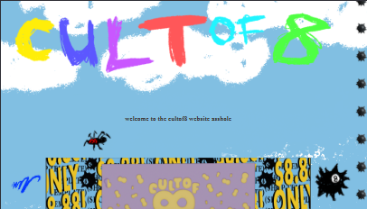
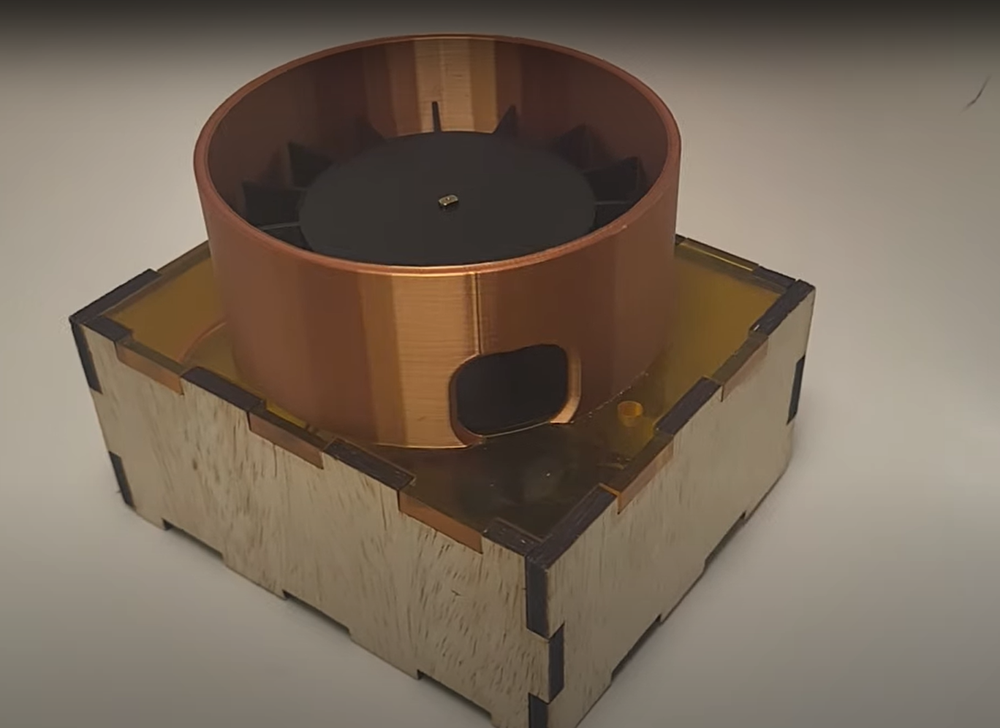

# 👋 Hi, I'm Sena!

  

## 💫 About Me

I'm a software engineer and creative technologist passionate about bridging technical expertise with human-centered design. Currently pursuing dual degrees in Computer Science and Creative Technology & Design with a focus on cybersecurity, software development, and user experience.

- 🔭 I'm currently working as a **Learning Assistant** and **Makerspace Technician** at my school's creative institute
- 👩🏽‍💻 Looking forward to my **Internship** at **Google**
- 🌱 I'm diving deeper into **Cybersecurity**, **Full-Stack Development**, and **Human-Computer Interaction**
- 👯 I'm looking to collaborate on projects involving **Creative Tech**, **Hardware Hacking**, or **UX Design**
- 💬 Ask me about **physical computing**, **ethical hacking**, or **human-centered design**

## 🛠️ Tech Stack

  

## 🚀 Featured Projects

### CultOf8 Website

- **Description**: Developed a complete e-commerce solution for a Creative Collective (group of people who create things).
- **Tech Stack**: HTML, CSS, JavaScript, Ecwid e-commerce platform
- **Key Features**: Custom 3D elements, integrated e-commerce, responsive design
- **Role**: Led UI/UX design process and full-stack implementation
- [View Live Site](https://cultof8.me)
- [View Repository](https://github.com/rowan878/rowan878.github.io)

 

### RX Remedy (T9Hacks Hackathon Winner)

- **Description**: Created an Automatic Pill Disperser at the T9Hacks Hackathon sponsored by Medtronic
- **Tech Stack**: C++, Arduino IDE, Rhino7, Adobe Illustrator, Arduino BLE, Arduino Cloud Agent, Claude
- **Key Achievement**: First place winner
- **Team**: Collaborated with [keha5124](https://github.com/keha5124) and [Yash1hi](https://github.com/Yash1hi)
- [View Project](https://github.com/Yash1hi/T9Hacks2025)
- [View Devpost](https://devpost.com/software/rx-remedy)

 

### Personal Website
- **Description**: Designed and developed my personal portfolio website
- **Tech Stack**: HTML, CSS, JavaScript, GitHub Pages
- **Features**: Responsive design, project showcase, interactive elements
- [View Live Site](https://senas.me)
- [View Repository](https://github.com/suctuk/suctuk.github.io)

## 📊 GitHub Stats

  

## 📫 Connect With Me

  

## 🎯 Interests & Hobbies

- Physical Computing and Hardware Hacking
- Cybersecurity and Ethical Hacking
- Web Development and Design
- 3D Printing, Laser Cutting, and Digital Fabrication
- Jewelry Making

---

  

